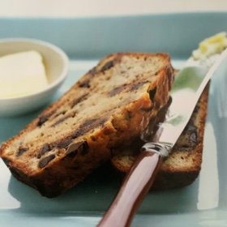

# Choc banana bread
## The goat. Banana bread with chocolate chips. Enough said.

### Serves: 8
### Difficulty (/10): 4
### Rating (/10): 9
### Images:

----
## Ingredients:
- 250g (1 cup) plain flour
- 2 teaspoons baking flour
- 125g unsalted butter (softened)
- 250g (1 cup) caster sugar
- 4 ripe bananas, mashed
- 2 eggs, lightly beaten
- 1 teaspoon vanilla extract

## Method:
1. Preheat oven to 180 degrees celsius
2. Sift the flour and baking powder into a large bowl
3. Mix the butter, sugar, banana, eggs, vanilla and chocolate chips into a separate bowl. Add to the dry ingredients and stir to combine, being careful not to overmix
4. Pour the batter into a loaf tin and bake for *1 hour and 5 minutes*, or until the bread is cooked when tested with a skewer
5. Leave to cool in the tin for 5 minutes before turning out onto a wire rack to cool

----
### Cooking time: 1hr 5m
### Prep time: 15m
### Total time: 1hr 20m
----
### Post recipe notes
- If making gluten free, add slightly more flour than the normal recipe to prevent the cake from being too gluggy. You may also need to cook a tad longer as well.

----
### Author: Bill granger
### Source: Best of Bill
----
*Tags:*
dessert, banana bread, sweet, chocolate